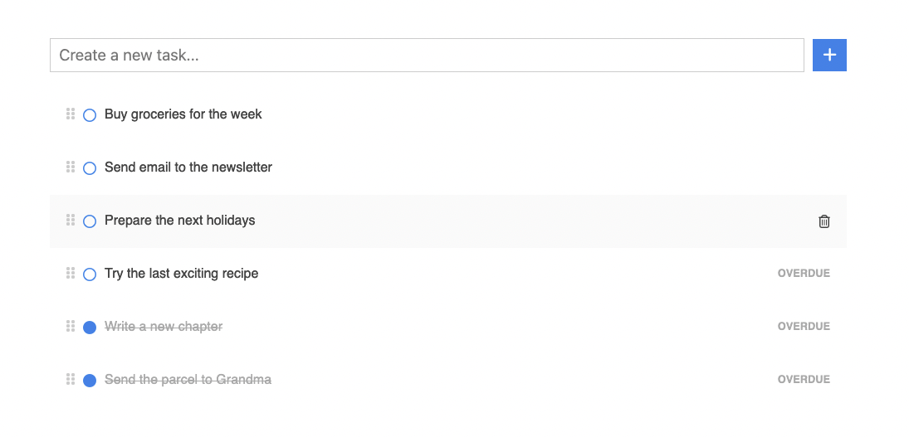

# Today or never!

Simply organize your daily tasks, and focus on what you can actually do today!

## Features

- Focus on what you can do today
- Recycle overdue tasks
- Organize and sort your tasks as you wish
- Very minimal and distraction-free interface




## Compile and run

```
make
make run
```

## Use it!

Open [http://localhost:8080](http://localhost:8080/) in your browser.

## Stack

Built with [Golang](https://go.dev/), [HTMx](https://htmx.org/) and [SQLite](https://sqlite.org/).
